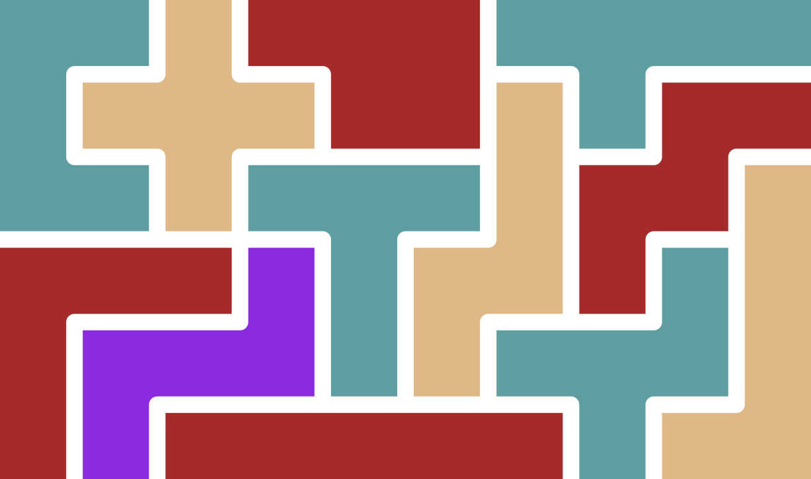

Python Polyomino Packing scripts
--------------------------------

A polyomino is a domino made with more than 2 squares. The shapes in Tetris are pentominos;
 they are shapes made up of 5 squares. The term was coined by Martin Gardner in his Scientific American column.

Packing polyominos is a mathematically interesting problem. This repository contains
python scripts for packing polyominos into rectangles, i.e., for Pentominos:



The code in this repository was either translated or derived from [Karl Dahlke's C code](https://eklhad.net/polyomino/index.html),
who requested that the code be used only for personal use, thus these scripts are distributed with the Creative Commons
[Attribution-NonCommercial 3.0 Unported (CC BY-NC 3.0)](https://creativecommons.org/licenses/by-nc/3.0/) license.

Usage
=====

Download [python > 3.8](https://www.python.org/downloads/release/python-382/). 
Clone this repo, and install the dependencies by running the command:

```bash
python -m pip install -r requirements.txt
```

Then to run the pentomino solution finder, run the command:

```bash
python hexsol.py -d -c -s 3
```

where 3 is the width of the board. -d outputs the solutions to the screen, -c outputs the number of solutions,
and -s generates an svg of the solution. 